#Windows Server Homelab

##Windows Server ortamında sistem yönetimi ve ağ servislerini uygulamalı olarak öğrenmek amacıyla oluşturduğum homelab projesi.

## Ortam
- Sanallaştırma: VMware Workstation
- Sunucu: Windows Server 2025
- İstemci: Windows 11
- Domain: techlab.local
- Ağ: 192.168.197.0/24

## Yapılan Çalışmalar
- Active Directory Domain Services (AD DS)
- Domain kullanıcı yönetimi
- Organizational Unit (OU) yapısı
- DNS yapılandırması
- Group Policy (GPO)
- DHCP yapılandırması
- Windows 11 istemcinin domain'e dahil edilmesi
- İstemci tarafında GPO ve DHCP testleri

## 1.VMware Ortamının Kurulması
Lab ortamı VMware Workstation üzerinde oluşturuldu. Windows Server 2025 ve Windows 11 istemci sanal makineleri kurularak aynı sanal ağ üzerinde çalışacak şekilde yapılandırıldı.
- DC01: Windows Server 2025 – Domain Controller, Active Directory, DNS ve DHCP
- WIN11-CL01: Windows 11 – Domain'e bağlı istemci bilgisayar

## 2.Active Directory ve Domain Yapısının Kurulması
Windows Server üzerinde Active Directory Domain Services (AD DS) kurulumu gerçekleştirildi ve techlab.local domain yapısı oluşturuldu. DC01, Domain Controller olarak yapılandırılarak Active Directory üzerinden kullanıcı ve bilgisayar yönetimi sağlandı.

DC01 sunucusuna statik IP adresi tanımlanarak domain servisleri için gerekli ağ yapılandırması gerçekleştirildi.

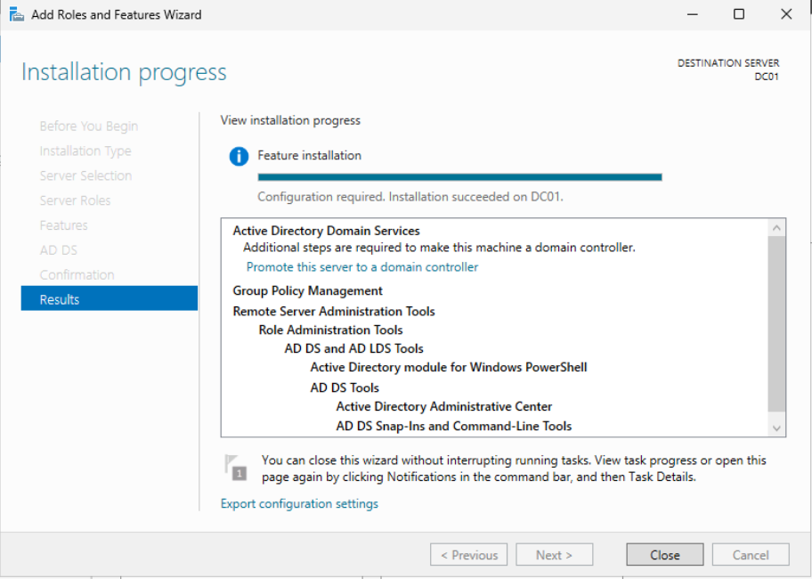

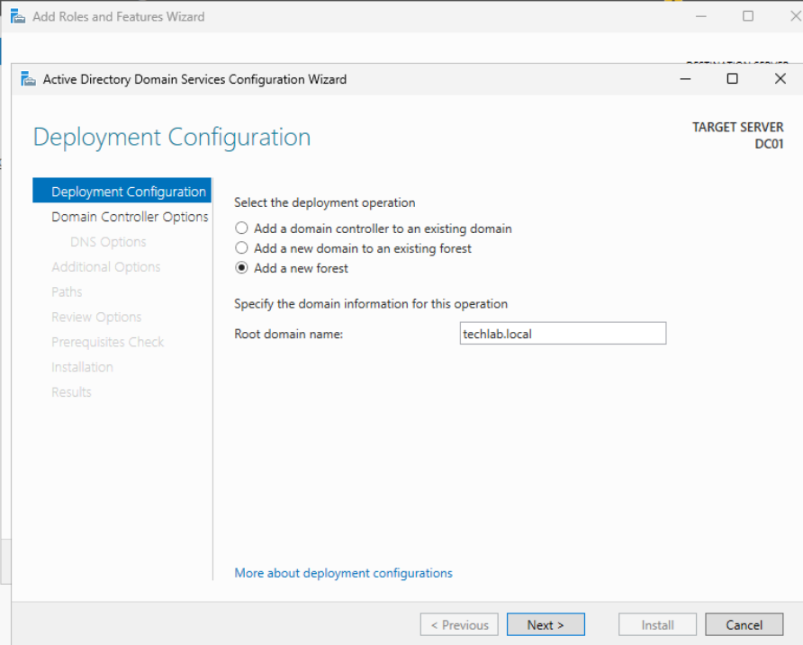

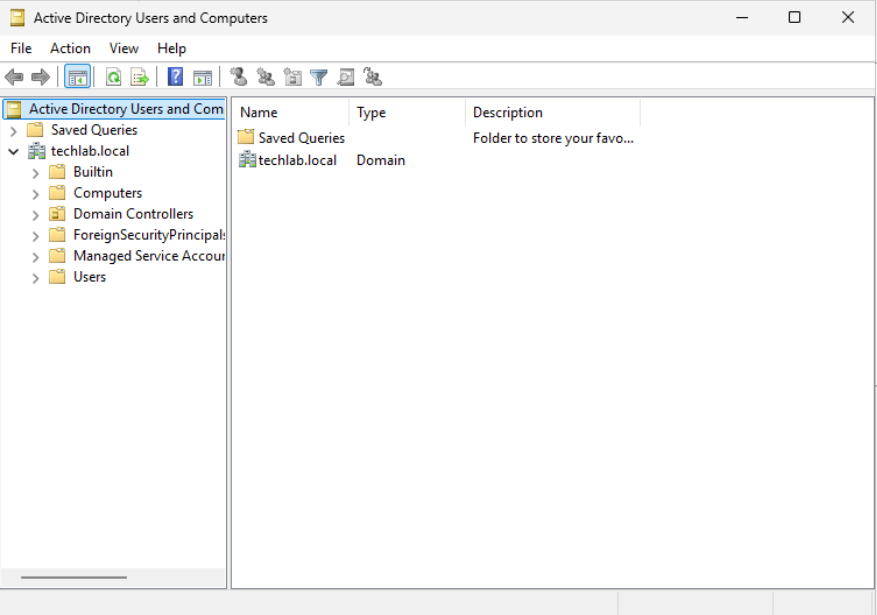

## 3.Organizational Unit (OU) Yapısının Kurulması
Active Directory içerisindeki kullanıcı ve bilgisayarların daha düzenli yönetilebilmesi için Organizational Unit (OU) yapısı oluşturuldu.

Kullanıcılar için IT, Sales ve Management birimleri; bilgisayarlar için Workstations yapısı oluşturuldu. Ayrıca sunucular ve yönetim amaçlı kullanılacak nesneler için ayrı OU'lar oluşturularak Active Directory ortamı düzenlendi.

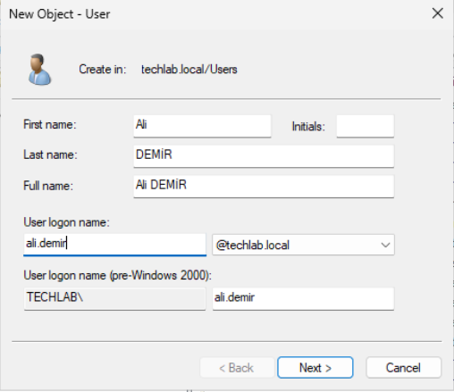

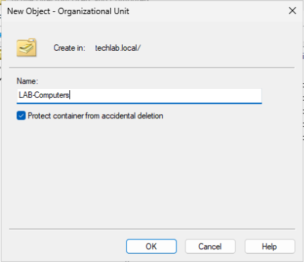

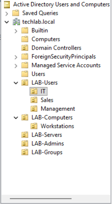

## 4.DNS Yapılandırılması
Domain ortamında isim çözümleme işlemlerinin sağlanması amacıyla Windows Server üzerinde DNS yapılandırıldı. techlab.local domaini için gerekli DNS bölgesi oluşturularak istemci bilgisayarın domain kaynaklarına isim üzerinden erişebilmesi sağlandı.

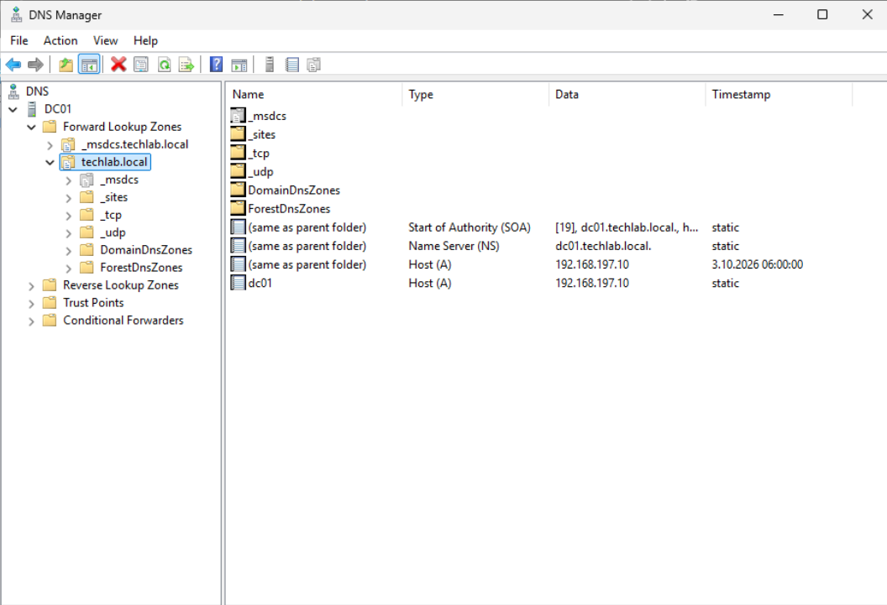

## 5.Windows 11 İstemcinin Domain'e Dahil Edilmesi
İstemci ilgisayar, oluşturulan techlab.local domain ortamına dahil edildi.

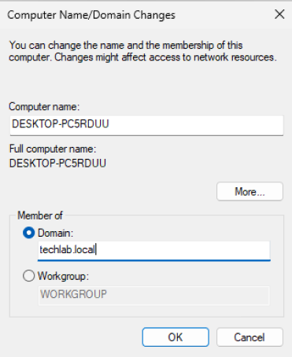

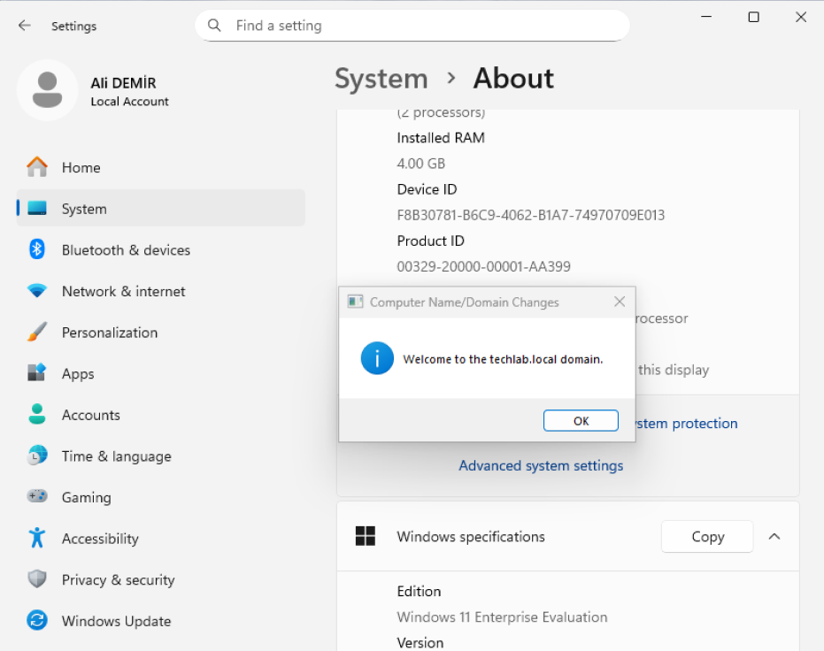

## 6.Group Policy (GPO) Yapılandırması
Domain ortamındaki bilgisayar ve kullanıcıların merkezi olarak yönetilebilmesi için Group Policy (GPO) yapılandırmaları gerçekleştirildi.

Bilgisayarlar için otomatik güncelleme ayarları ve oturum açma bilgilendirmesi uygulanırken, IT kullanıcıları için masaüstü arka planının değiştirilmesini engelleyen bir kullanıcı politikası oluşturuldu.

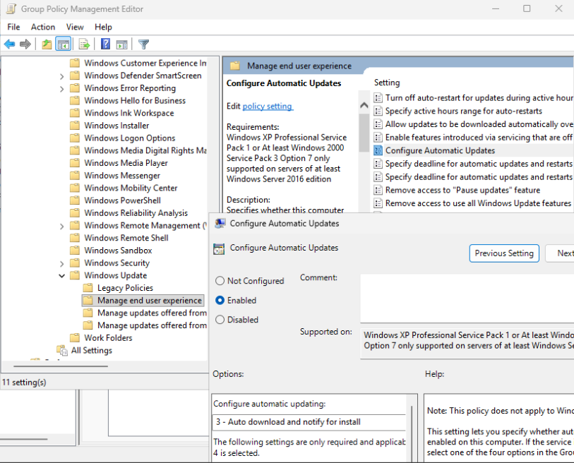

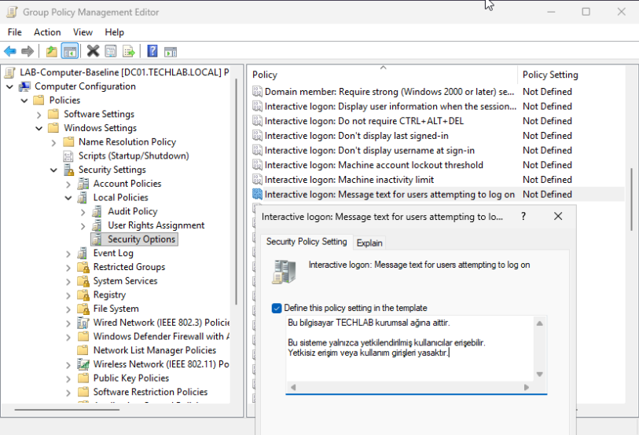

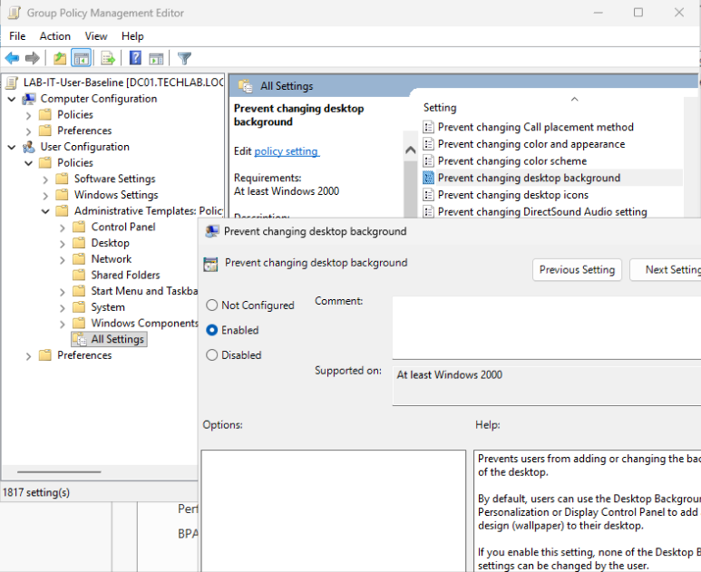

## 7. DHCP Yapılandırması
İstemci bilgisayarların IP yapılandırmalarını otomatik olarak alabilmesi için Windows Server üzerinde DHCP Server rolü yapılandırıldı. TECHLAB-Clients isimli DHCP scope oluşturularak 192.168.197.100 - 192.168.197.200 aralığı tanımlandı.

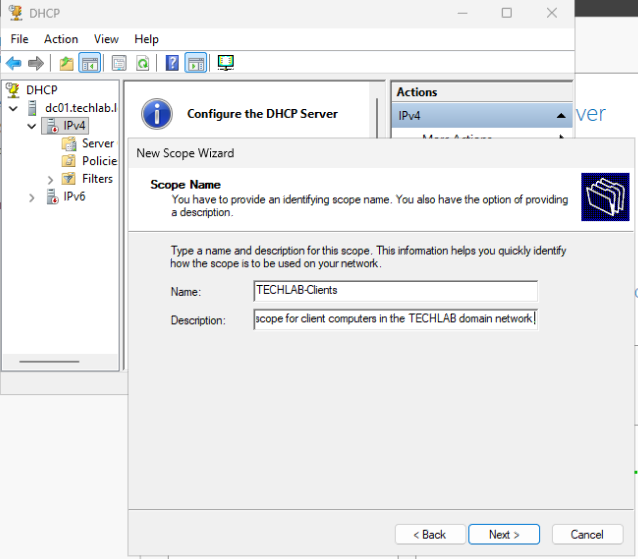

## Proje Durumu

Temel Windows Server lab ortamı tamamlandı. Active Directory, DNS, DHCP ve Group Policy yapılandırmaları gerçekleştirilerek Windows 11 istemci üzerinde test edildi.

Bir sonraki aşamada File Server, SMB, NTFS izinleri ve FSRM yapılandırmalarının eklenmesi planlanmaktadır.

